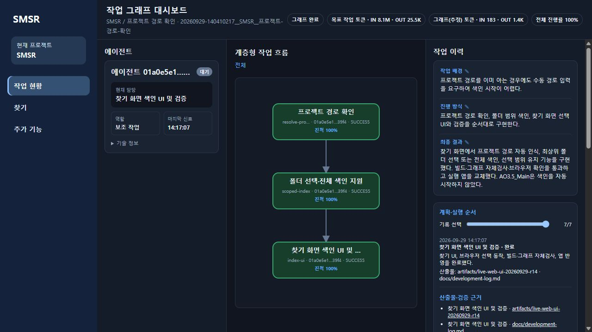
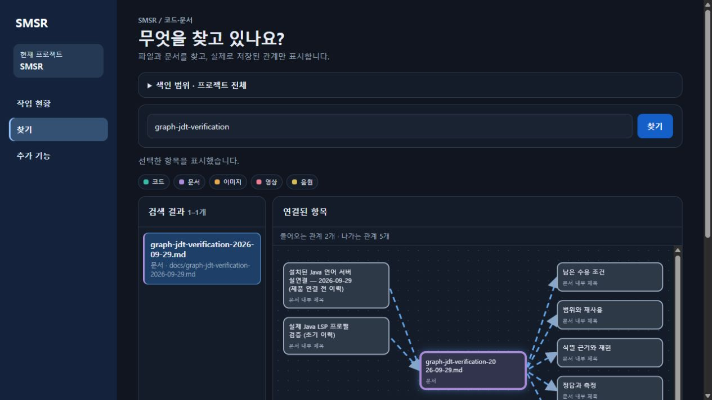

# SMSR

SMSR은 Codex 작업의 계획·진행·결과를 로컬 SQLite에 기록하고 WPF 앱과 웹에서 확인하는 Windows 앱입니다. 현재 소스 버전은 **v1.7.0**입니다.

## 빠른 시작

1. Windows에 .NET 10 SDK를 설치한 뒤 아래 명령으로 앱을 실행합니다. WPF 본체는 .NET 8을 사용하고, 선택형 C# 파일 묶음 분석기는 .NET 10 런타임과 SDK 내 Roslyn을 사용합니다.

   ```powershell
   dotnet run --project src/SMSR.App/SMSR.App.csproj
   ```

2. SMSR을 처음 실행하면 로컬 서버와 Codex MCP·전역 추적 훅을 구성합니다. Codex를 다시 열고 훅 신뢰를 승인합니다. 연결이 실패했거나 앱 위치를 옮겼을 때만 `서버 · 연결`의 `연결·그래프 추적 설정 복구`를 사용합니다.
3. WPF 앱의 `작업 현황`에서 프로젝트와 작업을 선택하고 `대시보드 열기`를 누릅니다. 웹의 `작업 현황`은 왼쪽에 **SMSR에 기록된** 에이전트, 가운데에 작업 순서도, 오른쪽에 작업 배경·진행 방식·최종 결과와 선택 작업의 상세 기록을 보여줍니다. 이력 항목은 더블클릭해 편집할 수 있습니다.
4. 웹의 `찾기`에서는 `색인 범위`를 펼쳐 프로젝트 전체 또는 폴더를 선택하고 `색인 시작`을 누릅니다. 파일명·심벌명·경로와 종류 필터로 검색합니다. 선택 항목의 연결은 방향·종류를 바꿔 페이지별로 확인하며 관계선을 누르면 원문 근거를 엽니다. `경로 시작` → 다른 항목 선택 → `여기까지 경로`는 두 대상 사이의 연결 단계를, `영향 보기`는 들어오는 직접·간접 관계를 표시합니다. `분석 근거`·접힌 `색인 진단`에서 오래된 원문과 분석 한계를 확인합니다. 별도 심층 분석은 `추가 기능`에 있습니다.

서버는 `http://127.0.0.1:49783`의 `127.0.0.1`에만 연결됩니다. 계산·검색·읽기 전용 확인은 기록하지 않으며, 파일을 바꾼 간단한 작업은 날짜별 일지, 복잡한 작업은 설정에 따라 작업 그래프에도 기록합니다.

## 현재 화면

아래 이미지는 2026-09-30에 실행 중인 **v1.7.0 웹 앱**에서 직접 캡처한 화면입니다. 예시 작업 데이터는 환경마다 다릅니다.



`작업 현황` — 노드를 선택하면 해당 작업의 상태·결과와 관련 이력을 확인합니다. 활성 SMSR 그래프에 연결된 실제 하위 에이전트의 시작·종료, 부모 ID와 제공된 모델을 수집합니다. 담당 노드·진행·결과는 각 에이전트의 명시적 상태 기록으로 연결합니다. 2026-09-30 실제 하위 에이전트 두 개의 독립 진행·종료와 DB·웹 표시를 검증했습니다. SMSR에 연결하지 않은 모든 Codex 대화를 자동 추적하는 기능은 아닙니다.



`찾기` — 색인한 코드·문서를 검색하고 저장된 관계의 방향과 원문 근거를 탐색합니다. 관계가 없거나 일부만 분석된 파일도 있으므로 이 화면이 실행 순서나 완전한 호출 그래프를 보장하지는 않습니다.

## 큰 구조 보기 (2026-10-02)

`찾기`의 보조 지도는 **프로젝트 전체 → 폴더 → 파일 내부 항목**으로 탐색합니다. 현재 기본 화면은 파일 검색·역할·관계·근거 중심이며 지도는 접혀 있습니다. 특정 프로젝트명·언어·프레임워크에 맞춘 분류가 아니라 저장된 상대 경로로 묶습니다. 문서·미디어도 같은 방식으로 표시하며, 파일 내부에는 실제로 색인된 심벌·개념만 나옵니다. 폴더 구조는 설계 역할이나 실행 순서를 추론한 결과가 아닙니다.

- 폴더/파일을 눌러 내려가고, 위 경로 버튼으로 돌아갑니다. 심벌을 선택하면 기존 상세·원문·주변 관계와 연결됩니다.
- 현재 영역과 바깥 연결을 구분합니다. 관계선을 선택하면 방향·종류·확정/추론 상태·원문 표본을 확인합니다. 양방향 관계는 한 선으로 묶되 근거에서 각각의 방향을 유지합니다.
- 노드 직접 드래그/방향키로 배치를 바꾸고 `배치 초기화`로 복원합니다. 배치 변경은 관계 데이터나 DB를 변경하지 않습니다.
- `현재 영역 찾기`는 지금 열린 폴더/파일의 항목을 걸러냅니다. 프로젝트 전체 검색은 기존 위쪽 검색창을 사용합니다.
- 지도는 내부24개·바깥8개·연결 묶음80개까지 표시합니다. 표시되지 않은 항목은 안내 건수와 접힌 전체 목록(50개/페이지)에서 확인합니다. 교차 관계 요약은 최대2,000개이며 생략 건수를 표시합니다. 기존 상세 관계 조회는 그대로 유지합니다.
- `세부 분석 그룹 찾기`는 기본 접힘입니다. 기존 커뮤니티 분석은 여기서 명시적으로 사용하며 실제 파일 경로/항목명으로 그룹을 검색합니다. 12개씩인 보조 목록을 전체 구조 지도로 오해하지 않도록 분리했습니다.

구조 조회는 저장된 리비전에서 읽기만 수행합니다. 변경된 소스가 자동으로 반영되는 것은 아니므로 필요하면 색인을 갱신합니다. 탐색 중 리비전이 바뀌면 `다시 확인`으로 새 스냅샷을 엽니다. 구조 조회 한도는5만 노드·20만 관계이며 초과하면 오류로 안내합니다. 미해소 호출을 새롭게 확정하거나 누락된 관계를 만들어내는 기능은 아닙니다.

일반 혼합 언어/문서·미디어 샘플, 한글·공백·깊은 경로, 빈 데이터, 5,000개 파일과5,150개 항목 샘플로 검증했습니다. SMSR/AO3는 운영 호환 검증에만 사용합니다. [샘플 실제 화면](docs/images/graph-structure-general-2026-10-02.png), [개발 이력](docs/development-log/2026-10-02.md).

## Codex 연결

1. SMSR을 한 번 실행한다. 서버, Windows 자동 시작, Codex MCP와 전역 일일 기록·그래프 훅이 자동 구성된다.
2. 처음 등록하거나 기존 OAuth 연결에서 업데이트한 환경에서는 Codex를 한 번 다시 열고 전역 훅 신뢰만 승인한다.
3. 계산·검색·질문·읽기 전용 확인은 기록하지 않는다. 파일을 바꾼 간단한 작업은 날짜별 일지에만, 복잡한 작업은 설정에 따라 그래프와 일지에 기록한다.

`서버 · 연결` 탭의 `연결·그래프 추적 설정 복구` 버튼은 자동 설정이 실패했거나 실행 파일을 옮겼을 때만 사용한다. 작업 그래프는 사용자가 요청하거나 설정된 복잡도 기준을 만족할 때만 생성되고 해당 작업이 끝날 때까지만 갱신된다.

별도 Codex CLI, Node.js, npm은 필요하지 않습니다. SMSR은 `WindowsApps` 내부 실행 파일을 호출하지 않고 Codex가 공유하는 설정 파일을 직접 갱신합니다. 기존 설정 파일은 변경 전에 `config.toml.smsr.bak`으로 백업합니다.

## 다른 Windows PC에 설치

다른 PC에는 자체 포함형 단일 설치 프로그램을 전달합니다. 사용자가 받거나 실행하는 배포물은 Setup EXE 하나이며, 설치 내부 구성요소는 화면 앱과 stdio 브리지가 같은 런타임을 공유합니다.

```powershell
powershell -ExecutionPolicy Bypass -File .\scripts\build-installer.ps1
```

결과는 `artifacts\installer\SMSR-Setup-버전-win-x64.exe`와 자동 업데이트 검증용 `.sha256` 파일로 생성됩니다. 설치 프로그램은 관리자 권한 없이 현재 사용자에게 설치하며 시작 메뉴, Windows 자동 시작과 제거 프로그램을 등록합니다. 설치된 SMSR을 처음 실행하면 해당 PC의 Codex 공유 MCP 설정과 전역 기록 훅을 구성합니다. 대상 PC에는 .NET SDK가 필요하지 않습니다. 자세한 설치·업데이트·제거·무인 설치 방법은 [Windows 설치 프로그램 안내](docs/installer-quickstart.md)를 참고하세요.

설치 Wizard는 SMSR 브랜드 배너와 Windows 테마를 따르는 라이트·다크 화면을 제공합니다.

ZIP 휴대용 배포가 필요한 개발자는 [휴대용 배포 빠른 시작](docs/portable-quickstart.md)을 참고할 수 있지만, 일반 사용자 배포 기준은 설치 프로그램입니다.

등록되는 설정은 다음과 같습니다.

```toml
[mcp_servers.smsr]
command = "<이 PC에 설치된 SMSR.Bridge.exe 절대 경로>"
args = ["--mcp-stdio"]
startup_timeout_sec = 30
tool_timeout_sec = 60
enabled = true
```

Codex는 설치된 `SMSR.Bridge.exe` 콘솔 브리지를 직접 시작합니다. 대시보드 본체가 꺼져 있으면 브리지가 같은 폴더의 `SMSR.App.exe`를 백그라운드로 한 번만 시작하고 서버 준비를 기다립니다. 브리지는 현재 Windows 사용자만 복호화할 수 있는 DPAPI 전용 토큰으로 `127.0.0.1` 서버에 연결하므로 브라우저 OAuth, 별도 Codex CLI, Node.js, npm이 필요하지 않습니다. 실행 파일 절대 경로는 설치 또는 휴대용 실행 시 해당 PC의 실제 위치로 자동 다시 생성되며 소스에는 하드코딩하지 않습니다. HTTP OAuth endpoint는 호환·진단용으로 유지됩니다.

추적 규칙은 MCP `instructions`와 사용자 전역 Codex 훅으로 제공됩니다. 실제 파일 변경은 `record_daily_activity`로 제목·요약·파일·검증만 남깁니다. 그래프는 명시 요청 또는 `복잡한 프로젝트 작업 자동 추적`을 켠 상태에서 여러 단계·파일·검증 등 복잡도 조건을 두 개 이상 만족할 때만 생성합니다. 활성 그래프에는 최초·관련 후속 사용자 요청을 원문이 아닌 1~2문장 요약으로 노드 시작 이력에 남깁니다. 계산·짧은 검색·질문·작은 단일 수정은 그래프를 만들지 않습니다. 모든 노드가 종료되면 추적 범위를 닫고 이후 작업을 무조건 새 그래프로 만들지 않습니다. 프롬프트 원문, 비밀, 명령 원문, 도구 입력·출력은 저장하지 않습니다.

`--self-test`는 DPAPI 사용자 프로필이 로드된 일반 사용자 세션에서 실행해야 합니다. 조건이 맞지 않으면 앱이 충돌하지 않고 상세 오류를 표시합니다.

코드·문서 관계 색인은 웹 메뉴의 `찾기`에서 프로젝트 전체 또는 표시된 폴더를 선택해 시작합니다. 파일·Markdown 링크, Graphify 기반 코드 심벌·선언·호출·참조·상속, `.csproj`·`.slnx`의 명시적 프로젝트 참조와 작업 산출물 연결을 기존 SQLite에 저장·조회합니다. 기본 색인은 Graphify의 정적 추출·해소 규칙을 사용하며 컴파일러 판정이나 실제 실행 순서가 아닙니다. 기존 Roslyn 등 선택형 분석기는 `추가 기능`에 유지합니다. 사용법과 제외 범위는 [그래프 안내](docs/graph-tracking-guide.md#p1-코드문서-관계-색인)를 참고하세요.

[웹 공통 UI 인터랙션 시안](docs/graph-explorer-ui-preview-2026-09-29.html)은 예시 데이터로 만든 디자인 참고 자료입니다. 실제 웹에서는 `/graph/explore`의 `찾기` 한 화면에서 검색·연결 관계·원문을 탐색합니다. 함수 내부의 줄 단위 의존성은 `/graph/advanced`의 코드 분석 카드에서 확인하며, 보수적 추정이지 실제 실행 순서는 아닙니다. 저장 결과가 없거나 오래된 경우에만 사용자가 `분석·저장`을 실행합니다. 기존 `/graph`의 색인·상세 도구도 유지합니다. 시안의 단계 재생은 [thinking-orbs](https://github.com/Jakubantalik/thinking-orbs)의 움직임 감소 원칙을 참고한 독립 코드입니다. 실제 웹 화면의 검색·색인·분석·작업 지시 대기 표시는 제공된 thinking-orbs 0.3.1 로컬 리비전 `de85557ca220332586d070d8788c0e1d6e877a0d`의 React 비의존 엔진을 로컬 자산으로 포함해 사용합니다. 저작권·MIT 전문은 [동봉 라이선스](src/SMSR.App/WebAssets/thinking-orbs-LICENSE.txt)에 있고, 인터넷 CDN이나 React 런타임은 사용하지 않습니다. 기존 색인·관계 기능은 [Graphify](https://github.com/Graphify-Labs/graphify/tree/4c21b15e9beeba5faa6871ad7dd188571a6fbb84)의 증분 감지·근거 구분·진단 방식을 참조했습니다. Graphify 코드를 직접 포함할 경우 Apache-2.0 및 NOTICE 고지를 유지해야 합니다. 상세 구현 참조는 [그래프 기능 계획서](docs/smsr-graph-capability-plan-2026-09-28.md)에 기록했습니다.

`찾기`에는 코드·문서·이미지·영상·음원의 종류 필터와 노드 색상을 표시합니다. 문서 제목은 별도 검색 항목에서 제외하되, 문서 안 링크의 근거를 위한 내부 노드는 유지합니다. 색인된 이미지(PNG/JPEG/GIF/WebP/BMP/AVIF), 영상(MP4/WebM/Ogg), 음원(MP3/WAV/Ogg/M4A)은 선택 항목에서 바로 열거나 재생합니다. 브라우저가 지원하지 않는 코덱은 재생되지 않을 수 있으며 SVG는 보안상 미리보기를 제공하지 않습니다. 미디어 본문은 DB에 저장하지 않고 색인 해시 확인 후 로컬에서 제공합니다. 이미지는 20 MB, 영상·음원은 100 MB까지 색인합니다.

### 단순한 찾기와 근거 연결 역할 설명 · 2026-10-02

`찾기`를 **검색 결과 → 역할·동작·관련 항목 → 원문**의 두 칸 화면으로 변경했습니다. 연결 지도와 추가 분석은 기본 접힘이며, 전체 지도는 펼칠 때만 조회합니다. 검색·종류 필터·페이지·색인 범위·미디어 재생과 기존 지도 드래그는 유지합니다. [실제 적용 화면](docs/images/find-role-live-2026-10-02.jpg).

Graphify 0.9.73의 [explain 구현](https://github.com/Graphify-Labs/graphify/blob/ef4450d9c28acb2b8cdc22d369c1777b77148eef/graphify/cli.py#L1641)과 query 스킬의 **원문·관계 근거 수집 → 호스트 에이전트 해석 → 출처 있는 설명** 방식을 참고했습니다. 원본 CLI의 메타데이터 출력만으로 의미 설명이 생성되는 것은 아닙니다. 이 경로는 SMSR 구현이며, 자동 생성은 사용자가 승인한 현재 로그인된 Codex 실행기를 사용합니다. 별도 API 키를 추가하지 않습니다.

- MCP `get_graph_role_context`는 선택 원문과 실제 호출·참조 발생 위치를 검증합니다. 파일을 선택하면 그 파일에 선언된 심벌 관계도 포함합니다. 최대20관계·13인용 범위이며, 원문 지문 불일치·접근 불가·비밀값은 근거에서 제외합니다.
- 호스트 에이전트가 읽고 작성한 역할·동작·관계·명시된 설계 이유를 `submit_graph_role`로 저장합니다. 문장별 실제 인용과 근거 ID가 필요하며 추정·미해소 호출을 확정 관계로 저장하지 않습니다. 원문 인용 일치는 의미 해석의 정확성을 보장하지 않으므로 에이전트의 코드 검토가 필요합니다.
- `get_graph_role`은 SQLite 파생 결과의 CURRENT/MISSING/STALE 상태를 조회합니다. 원문 또는 관련 근거가 바뀐 설명은 현재 결과로 반환하지 않습니다. 관계 원문이 변경되면 화면에도 근거 확인 필요를 표시하고 오래된 위치의 원문 버튼을 숨깁니다.
- 검색 결과는 파일 중심이며 클래스·함수 이름으로 검색해도 소속 파일을 반환합니다. 파일 내부 심벌은 `구성요소 · 클래스·함수`에서 필요할 때만 펼칩니다. 클래스 내부 함수는 소유자 이름을 포함하며 파일 60개·계층별 심벌 30개 단위로 넘깁니다. 관계 데이터는 삭제하지 않습니다.
- 설명 없는 코드에서 `설명 생성`을 누르면 실제 Codex 분석 → 인용·지문 검증 → SQLite 저장 → 화면 갱신까지 진행합니다. 대기·분석 중·실패 상태와 명시적 재시도도 지원합니다. MCP는 `request_graph_role`, `get_graph_role_job`, `get_graph_role_coverage`로 연결하며 새 도구는 클라이언트 목록 갱신 후 보입니다.
- `설명 현황 확인`은 코드 파일 기준 최신·미분석·오래됨 목록과 건수를 표시합니다. 요청 처리 건수는 심벌 요청도 포함합니다. 이미 자동 생성을 요청한 항목만 다음 색인에서 변경 근거를 감지해 다시 요청합니다. **전체 파일을 임의로 자동 생성하거나 지속 감시하는 기능은 아닙니다.** Codex 사용량을 소비합니다.
- 자동 실행은 별도 임시 작업 폴더의 읽기 전용 모드로 실행하며 사용자 설정·MCP·훅·셸 도구를 연결하지 않습니다. 제한된 근거만 전달하고 질문 원문은 저장하지 않습니다. 처리 제한은 5분이며 실패는 자동 반복하지 않습니다. 기본 모델의 정확한 식별자는 수집하지 않아 모델 이름을 추측하지 않습니다. 원문·관계가 많으면 부분 설명이며 컴파일러 판정이나 실행 흐름 증명이 아닙니다.

후속 개선의 Release 빌드 경고0·오류0, 파일 검색/심벌 계층·부분 클래스·역할 C#/HTTP/MCP 검사와 관련 JS 검사를 통과했습니다. 실제 Codex로 Python·C#·Java 설명을 생성·저장하고 Python 원문 변경 후 자동 재생성까지 확인했습니다. 현재 앱에도 적용·재시작했으며 실제 프로젝트 코드 `GraphQueryFiles`, `GraphRoleStorage`, `GraphRoleJobs`의 원문 기반 설명을 생성·검토했습니다. [적용 화면](docs/images/find-file-role-auto-2026-10-02.png), [검증·백업·남은 위험](docs/development-log/2026-10-02.md).

**과거 전체 색인 검사의 Git 오류는 이번 재실행에서 재현되지 않았습니다.** 기존 실행본과 후속 변경 실행본의 전체 회귀는 종료0이지만 과거 원인을 확정하거나 Git 원인 수정 완료로 판정하지 않습니다. 검증 중 발견한 구형 검색 계약 검사·미등록 화면 모듈·부분 클래스의 메서드 누락은 수정했습니다. 부분 클래스의 대표 노드가 다른 파일에 있으면 현재 파일의 메서드는 실제 소유자 이름을 붙여 표시합니다. 전역 훅 설정·Codex 설정·Git 게시는 변경하지 않았습니다.

### 설명 일괄 생성·Obsidian 보관함 연결 · 2026-10-02

`찾기`의 접힌 **여러 파일 설명 생성**에서 전체 코드 또는 폴더를 선택하고 `대상 확인` → 사용량 동의 → `설명 생성 시작` 순서로 사용합니다. 최신 설명은 재사용하고 근거를 확인할 수 없는 파일은 제외합니다. 진행·성공·실패·대기를 따로 표시하며 일시정지·재개·실패만 재시도할 수 있습니다. 일시정지는 실행 중인 분석을 강제 종료하지 않습니다. 요청·일괄 범위는 SQLite에 보존하며 재시작 시 실행 중 요청을 대기로 복구합니다. 다음 색인에서는 이전에 승인·요청한 항목의 변경 근거만 다시 분석합니다. 새 파일까지 무조건 LLM에 보내지는 않습니다.

**Obsidian 보관함 연결**은 다음 순서입니다.

1. 프로젝트 저장소 **밖의 로컬 폴더**를 선택합니다. 새 전용 폴더라면 `없는 폴더 새로 만들기`를 선택합니다.
2. 생성 영역 쓰기에 동의하고 `연결 저장` → `지금 동기화`를 누릅니다. 자동 동기화를 켜면 이후 색인·설명 변경도 반영됩니다.
3. Obsidian에서 같은 폴더를 보관함으로 등록합니다. `SMSR-generated/<프로젝트 식별자>/index.md`부터 읽습니다.
4. SMSR에서 파일을 선택하면 대응하는 `Obsidian 분석 노트 열기` 링크가 나타납니다. Obsidian 설치·보관함 등록·URI 연결은 사용자 환경에 필요합니다.

노트는 **파일당 하나**이며 역할·동작·상태·모델·문장별 원문 근거와 다른 파일의 위키 링크를 담습니다. 미분석·오래된 설명을 현재 설명처럼 꾸미지 않습니다. 문서·매체의 링크는 제공하지만 코드 설명용 LLM 일괄 대상에는 포함하지 않습니다. 파일 내부 호출은 SMSR의 상세·구성요소에서 확인합니다. 정적 관계는 실행 순서를 보장하지 않습니다.

변경된 노트만 다시 쓰고 개인 노트와 수정한 생성 노트는 충돌로 표시해 보호합니다. 소유 권한은 SQLite 지문 기준이며 수정 전 내용은 생성 영역의 `.smsr-backups`에 보존합니다. 삭제·이동된 원문 노트는 자동 삭제하지 않고 제외 상태로 남깁니다. 소유 목록 불일치·권한·잠금 실패는 성공으로 표시하지 않습니다. 강제 종료로 노트와 소유 목록이 불일치하면 백업 확인 또는 새 전용 보관함 연결이 필요할 수 있습니다. 복구를 위해 SQLite와 보관함을 함께 백업하세요.

Graphify 고정 리비전 `ef4450d9c28acb2b8cdc22d369c1777b77148eef`의 [Obsidian 내보내기](https://github.com/Graphify-Labs/graphify/blob/ef4450d9c28acb2b8cdc22d369c1777b77148eef/graphify/export.py)의 위키 링크·메타데이터·소유 목록·동일 내용 미쓰기 방식을 참조했습니다. SMSR 구현은 파일 중심 투영·검증된 설명·사용자 수정 보호를 추가하며 원본 exporter를 직접 복사하지 않았습니다. `.obsidian` 설정·테마·플러그인·클라우드는 변경하지 않습니다.

Release 빌드, 전체 그래프·지식·역할/보관함/HTTP 회귀, JS 상호작용 및 일반 혼합 샘플의 실제 화면을 확인했습니다. 실제 Obsidian 앱 실행 자체는 아직 검증하지 않았습니다. 과거 전체 색인의 Git 오류는 이번 회귀에서 재현되지 않았으므로 원인 해결로 단정하지 않습니다. [작업계획](docs/role-obsidian-plan-2026-10-02.md), [검증·백업·남은 위험](docs/development-log/2026-10-02.md).

2026-10-02 추가 인수 검사는 자동 검사 46개 중 43개 통과·3개 실패입니다. 실제 코드 4개 설명은 최초 3개 성공, 명시적 재시도 후 4개 저장됐지만 **사용자 최종 만족 품질에는 미달**했습니다. namespace의 파일 관계 투영, 동명 호출 후보, 인용 위치·검사 서버 링크, 핵심 역할 누락·가독성은 후속 수정이 필요합니다. 개인 노트·수정 노트 보호와 운영 그래프 보존은 확인했습니다. 실제 Obsidian 앱 인수는 미검증이며 이번에는 기능 수정·재배포하지 않았습니다. [실제 생성 결과](docs/function-quality-result-2026-10-02.html), [전체 검사·실패·다음 순서](docs/function-quality-test-result-2026-10-02.md), [독립 원문 대조](docs/function-quality-semantic-review-2026-10-02.md).

### 관계·설명·클라이언트 수정 · 2026-10-02

namespace/선언을 파일 호출로 오투영하던 판정과 실제 연결지도를 막던 새 모듈 HTTP 404를 수정했습니다. 지도에는 관계별 근거·추론 구분, 정확한 심벌 위치, 확대·전체 맞춤·배치 초기화를 적용합니다. 설명은 목적부터 제시하고 실제 인용 시작 줄을 연결합니다. 모델 출력의 근거 ID·개수 계약을 저장 검증과 일치시켰으며 검증은 완화하지 않았습니다.

대표 코드 4개의 실제 설명 저장과 독립 원문 대조, 시험 보관함 29노트의 증분·사용자 수정 보호를 확인했습니다. 다만 충돌 **목록**을 **개수**로 표현한 한 문장과 일부 복합 인용의 정확도는 추가 개선 대상입니다. 클라이언트 오늘/선택 유지/휠 수정은 자체 검사 통과이며 물리 입력과 외부 Obsidian 앱은 미검증입니다. 운영 앱은 이번에 재시작·배포하지 않았습니다. [검증 결과·남은 사항·다음 순서](docs/relationship-quality-fix-result-2026-10-02.md).

### Graphify 원본 추출 코드 재사용 · 2026-10-01

소스에는 Graphify **0.9.73**, 고정 리비전 `ef4450d9c28acb2b8cdc22d369c1777b77148eef`의 추출·그룹·분석 import closure **58개 모듈**을 수정 없이 [로컬 vendor](src/SMSR.App/GraphRuntime/vendor/UPSTREAM.json)에 포함했습니다. 라이선스 [Apache-2.0](src/SMSR.App/GraphRuntime/vendor/LICENSE), [기존 MIT](src/SMSR.App/GraphRuntime/vendor/LICENSE-MIT), [NOTICE](src/SMSR.App/GraphRuntime/vendor/NOTICE)를 보존합니다. SMSR 어댑터는 별도 파일이며 원본 CLI·MCP 서버·훅·provider 호출은 가져오지 않았습니다. 복사 절차는 `scripts/vendor-graphify-extraction.py`에 있습니다. 사용자 승인 후 2026-10-01 F2~F8 실행본을 백업·적용·재시작했습니다. 기존 저장 그래프는 재색인하지 않았으므로 새 추출 결과와 구분합니다.

- 소스의 코드 허용 목록은 103확장자이며 운영 Python에서 101확장자의 추출기 가용성을 확인했습니다. DM/DME는 파일 색인만 합니다. 기존 16문법과 추가 26형식의 선언·관계를 고정 원본과 대조했습니다. 확장자 수는 언어 수나 정확도 수치가 아닙니다. 누락된 고정 Groovy·Zig·VB.NET·Robot Framework 의존성을 추가했고 `pip check`와 추가26형식 원본 대조를 통과했습니다. PDF·미디어 로컬 의존성도 설치되어 있습니다.
- `코드` 필터는 파일과 심벌을 함께 검색합니다. 관계선은 `원문 근거`와 `추론한 관계`를 구분하며 마우스·Enter/Space로 선택할 수 있습니다. 모호하거나 색인 밖인 대상은 가짜 심벌을 만들지 않고 진단에 남깁니다. 원본 캐시가 제공한 구문 오류도 기록합니다.
- 파일 해시가 그대로이면 기존 색인을 재사용합니다. 일반 C#·Python의 검증된 변경은 저장된 의존성·미해소 후보를 사용해 영향 범위만 재분석합니다. C/C++ 전역 선언, C# partial·global using·모호한 구조, 설정·범위·분석 버전 변경과 미검증 언어는 이유를 남기고 전체 분석으로 전환합니다. 캐시 지원 언어의 무변경 AST와 증분 컨텍스트는 사용자 DPAPI로 암호화합니다. JavaScript/TypeScript 계열 추출은 원본 정책을 유지합니다. 원문·DB는 정리하지 않으며 미사용 캐시 30일·총 페이로드 1 GiB 정책은 활성 잠금·경로 보호 아래 적용됩니다.
- 코드 묶음 갱신 시 영향받는 소유 파일의 기존 API/MCP 선언·연결도 재생성합니다. v11 포맷은 구문 복구·호출 위치·심층 통합·증분 컨텍스트 변경을 반영하기 위해 기존 색인을 한 번 다시 구축합니다. UTF-8 BOM 정규화와 원문 해시 검증도 유지합니다.
- 허용된 파일만 임시 복사하고 분석 후 삭제합니다. 원문 본문·질문은 DB에 저장하지 않습니다. UTF-8 및 엄격한 왕복 변환이 가능한 CP949를 읽으며 원본 바이트 해시와 변환된 분석 입력 해시를 따로 검증합니다. 다른 인코딩·실행 실패·상한 초과는 이전 색인을 보존합니다.
- 적용된 실행본 제한: 허용 파일 50,000개, 텍스트 파일당 2,000,000바이트, 코드·설정 변환 입력 합계 256 MiB입니다. 8파일씩 암호화한 임시 배치로 전달합니다. 배치당 JSON 32 MiB·직렬화 합계 512 MiB, 제어 요청 32 MiB, 코드 결과 64 MiB·작업기 5분(1,000배치 초과 20분)·프로세스 메모리 상한 2 GiB입니다. 일반 고급 분석 출력 16 MiB·2분은 유지합니다. 교차 파일 해소를 보존하며 상한 초과 시 자동 누락 대신 이전 색인을 보존합니다.
- 운영 재색인 검증: SMSR 리비전 53은 784파일·4,972노드·14,546관계, AO3.5_Main 리비전 4는 2,604파일·20,321노드·46,990관계입니다. AO3에는 코드 심벌 17,692개·`CALLS` 15,350개가 저장됐습니다. 심벌/파일 간 요약 호출을 모두 포함한 관계 수이며 고유 실행 호출 횟수가 아닙니다. SQLite 무결성 정상·고아 관계 0, 실제 브라우저의 호출 근거와 원문 이동을 확인했습니다. [검증 화면](docs/images/graphify-ao3-calls-2026-09-30.jpg)과 [날짜별 이력](docs/development-log/2026-09-30.md)에 근거를 남겼습니다. 이후 재색인 수치는 달라질 수 있습니다.

### Graphify 지식 데이터 기반 · 2026-10-01

승인된 [14개 기능·9페이즈 계획](docs/graphify-capability-roadmap-2026-10-01.html)의 남은 **F4, F5-5, F6-3·4·6, F7, F8 소스 기능**까지 구현·검증하고 현재 앱에 적용했습니다. [최신 결과·사용법·측정·운영 인수](docs/graphify-final-source-status-2026-10-01.html)의 11절은 2026-10-02 관계 선택·정적 정보 보강 결과입니다. 독립 HTML 직접 열기와 새 세션 자동 인식은 사용자 지정 제외 사항입니다. Graphify 기준 정적 분석을 보강했으며 전 호출 해소나 컴파일러 판정을 의미하지 않습니다.

- 최신 운영 재색인: SMSR rev61은 1,228파일·6,930노드·20,434관계, AO3.5_Main rev11은 2,603파일·31,399노드·66,343관계입니다. 미분류 심벌은 491→244 / 13,299→5,848, 근거 없는 관계는 1,084→0 / 44→0입니다. 고아0·메타데이터 승격 불필요·색인 직후 최신성 정상입니다. 미해소 진단은 32,889/63,958이며 XAML·외부 API·동명·이벤트 제한은 남습니다. 이 결과 문서는 검증 스냅샷 이후 변경되므로 다음 최신성 검사에 잡힐 수 있습니다.
- C# 기존 사실의 유일한 AST 선언을 대조해 속성·열거형 항목·인터페이스·구조체·종료행을 보존하고 METHOD 소유 관계를 연결합니다. 근거 없이 종류/대상을 추정하지 않습니다. 확정된 반복 this 호출의 행을 보존하며 실제 AO3 호출2개가 추가됐습니다. 구조 관계의 출처는 SMSR로 기록하고 원래 Graphify 근거는 유지합니다.
- 겹친 연결선은 클릭점과 실제 선의 최단 거리로 선택합니다. 실제 마우스·Enter·노드 드래그 후106행 근거·초기화·오류0을 확인했습니다. [검증 화면](docs/images/graphify-quality-2026-10-02.jpg). 현재 두 보고서 READY이며 AO3 첫 분석의 FAILED1회는 재조회 후 READY로 확인했습니다. 원인을 확정하지 않았고 실패를 통과로 집계하지 않았습니다.
- 최신 전체 JSON/독립 HTML은 `artifacts/graphify-quality-acceptance-20261002-0027`입니다. 노드/관계 건수·모든 관계 근거·절단false·오프라인 페이지/그룹/검색/키보드/상세 검사를 통과했습니다. 보고서의 100그룹 표본 절단과 전체 데이터 내보내기는 별개입니다. 새 세션 인식·직접 file:// 열기는 검사하지 않았습니다. 이전 스킬 실사용·내보내기 이력은 결과 문서10절에 보존합니다.

- PDF·DOCX·XLSX의 텍스트와 페이지·문단/표·시트/셀 좌표를 읽습니다. 문서당 20,000,000바이트, 5,000구간·본문 1,000,000자 제한이며 암호화·압축폭탄·매크로·외부 링크 등 위험 입력을 거부합니다. 설치된 로컬 OCR로 스캔 PDF의 최대50페이지·영역 근거도 읽으며 빈 스캔은 텍스트 없음으로 유지합니다. `read_graph_document` → 호스트의 의미 추출 → `submit_graph_document_semantics` → `get_graph_document_semantics`로 원문 인용·모델·계약·해시를 검증해 저장합니다. 일반 색인만으로 모든 문서에 모델 의미 분석이 자동 실행되지는 않습니다.
- 개념·요구사항·설계 이유는 `문서` 필터/색상과 연결하고 원문 버튼으로 해당 근거 구간을 강조합니다. 명시적 코드 참조와 추론 후보를 구분하며 동명 대상은 자동 합치지 않습니다. 전체 원문은 저장하지 않지만 검증된 짧은 인용은 의미 근거로 저장합니다. 원문·의존 코드·모델·계약 변경 시 오래된 결과를 무효화하고 실패는 기존 유효 결과를 덮어쓰지 않습니다.
- 찾기의 `큰 그림 보기`에서 그룹·응집도·대표 구성요소·그룹 간 연결을 탐색합니다. 5,000노드 초과 시 자동 펼침, 그룹 페이지·상세 항목·초기화를 제공합니다. 추론 관계를 그룹 확정 근거로 사용하지 않습니다. 분석 상한은 50,000노드·200,000관계, 입력 64 MiB·결과 16 MiB·8분·프로세스 1 GiB입니다. MCP `get_graph_overview`는 긴 분석을 기다리지 않고 `ANALYSIS_PENDING`/`READY`/`FAILED`를 반환합니다.
- 프로젝트 전용 [smsr-query 스킬](.agents/skills/smsr-query/SKILL.md)은 실제 어휘 → 질문 후보 → 리비전 고정 근거 묶음 → 출처 있는 답변을 연결합니다. `get_graph_vocabulary`, `search_graph_question`, `get_graph_question_evidence`, `get_graph_feedback_lessons`를 검증했습니다. 유용·오류·교정·실패 경로 피드백을 다음 탐색에 재사용하되 원문 질문은 DB·로그에 저장하지 않고 관계 사실도 덮어쓰지 않습니다. 토큰 예산은 보수적인 UTF-8 바이트 추정이지 모델 tokenizer 실측이 아닙니다.
- 실제 AO3 사본 색인 2,603파일·31,399노드·66,341관계, SMSR 고정 사본 1,068파일·6,277노드·18,512관계를 검증했습니다. 운영 DB 수치가 아닙니다. 80질의/8동시 p95는 각각 714.42ms/232.77ms입니다. 50,000노드·200,000관계 그룹 작업기 371.98초도 별도 검사했습니다. 측정 조건·제한은 최신 보고서에 있습니다.
- F4 로컬 OCR·Whisper 전사·영상 표본 프레임과 영역/시간 원문 근거, F5-5 같은 리비전 보고서, 설명·영향·유지관리·보고서 스킬, 기본 꺼짐 변경 감시, 전체/선택 JSON·독립 HTML·SVG·GraphML·Wiki/Obsidian 내보내기를 추가했습니다. 의미 관계는 호스트가 명시 제출하며 추론을 확정 호출로 바꾸지 않습니다. 원문·추출 지문/인용이 달라지면 stale입니다.
- 사용자 승인으로 로컬 Tesseract·Whisper Tiny/eng·kor 모델과 미디어 의존성을 설치했습니다. `scripts/install-graph-media.ps1 -InstallOcr -DownloadModels`는 명시 설치용이며 실행 분석 중 다운로드·외부 파일 전송은 없습니다. 모델 고정 리비전/SHA manifest와 상한은 최신 보고서에 기록했습니다. 운영 Python의 확장 문법 가용성·PDF 보호·미디어 경계 검사도 통과했습니다.
- 배포 검증: DB 스냅샷·복원 및 정지 DB 무결성 통과, 새 HTTP/stdio MCP·AO3 보고서 READY·실제 코드 필터/관계·이력 접기·노드 선택 후 맵 스크롤108px 보존을 확인했습니다. SMSR rev59 5,124노드/15,063관계, AO3 rev9 20,406노드/48,711관계 유지·고아0입니다. [실제 배포 화면](docs/images/graphify-live-deploy-2026-10-01.jpg).
- 배포 당시 수치는 위 이력에 남기며 2026-10-02 최종 분석 검증 스냅샷은 SMSR rev63/AO3 rev13입니다. 결과 문서 갱신 후 유지관리 색인은 별도 리비전일 수 있습니다. 전체 미해소 관계가 해결된 것은 아닙니다. 제외한 새 세션 실사용과 HTML 직접 열기를 완료로 처리하거나 file:// 차단을 우회하지 않았습니다. 전역 훅/스킬 설정·Codex config·앱 설정·DB 교체·외부 의미 provider·Git 게시는 변경하지 않았습니다.

### 외부 참조·XAML·보고서 보강 · 2026-10-02

- 프로젝트에 명시된 NuGet 의존성을 구분하고 외부/원문 없음·로컬 미확정·모호한 대상을 진단합니다. 최대12개 후보 경로는 확인용이지 확정 호출이 아닙니다. 외부 API 실행·패키지 다운로드는 하지 않습니다.
- XAML의 화면 코드·화면 모델·이벤트 처리·속성/명령 바인딩·변환기를 구분합니다. 파일과 심벌 양쪽에서 조회하며 유일한 AST 소유 속성만 연결합니다. 템플릿·다른 소스·복잡한 DataContext는 속성 자동 연결에서 제외합니다. 런타임 DI로 설정되는 SMSR ViewModel은 정적으로 확정하지 않았습니다.
- 보고서 HTTP 분석은 앱 종료 토큰을 사용합니다. 취소·시간/메모리/입력 제한·작업기 실패를 비밀 원문 없이 표시하고 명시적 재조회로 복구합니다. 과거 AO3 일시 실패의 원인은 당시 세부 기록이 없어 확정하지 않습니다.
- v17은 문서·이미지 추가/삭제 때 변경 없는 프로젝트 패키지 노드·관계를 보존합니다. 실제 DB 회귀와 운영 rev65에서 기존 프로젝트 노드25개·세부 정보 복구를 확인했습니다(직전 rev64의21개 손실 복구). 최종 유지관리 색인 결과는 작업 그래프 J4/H1·최종 결과에 따로 남깁니다.
- 최종 코드 분석 검증: SMSR 1,239파일·6,955노드·20,524관계, AO3 2,603파일·31,399노드·66,372관계·실제 속성 바인딩15개. 두 프로젝트 고아/근거 없는 관계0·보고서 READY. AO3 파일2,603개 해시는 불변입니다. 상세 결과와 사용자 확인 순서는 [최신 결과 12절](docs/graphify-final-source-status-2026-10-01.html#reference-quality), 날짜 이력은 [2026-10-02](docs/development-log/2026-10-02.md)를 참고하세요.

- 기존 노드 ID·kind·검색은 유지하며 세부 종류·소유·선언 범위·설계 이유를 허용 목록으로 보존합니다. 원본 종류가 없으면 `unknown`이며 추정 복원하지 않습니다. 정적 관계는 분석기·버전·원문 지문·확실성·생성 시각을 보존하고 모호한 대상은 진단으로 유지합니다.
- 3~64개의 실제 노드와 역할·근거를 가진 hyperedge를 별도 저장합니다. `get_graph_hyperedges`와 `/api/graph/hyperedges`로 리비전별 조회하며 가짜 pairwise 호출을 만들지 않습니다. 잘못된 참여자·지문은 원자적으로 거부하고 삭제·변경 시 현재 그룹을 무효화하되 과거는 보존합니다.
- `get_graph_coverage`와 `/api/graph/coverage`는 파일·심벌·근거 보존 범위와 구형/미지원 상태를 페이지로 조회합니다. 전체 관계 완전성이나 분석 정확도 수치가 아닙니다. 페이지 최대 100, offset 최대 1,000,000입니다. 형식 v12는 다음 사용자 색인 때 새 메타데이터를 추출합니다.
- 우측 패널을 산출물·검증 근거와 같은 접이식 카드로 통일했습니다. 작업 이력·계획 순서·상세는 기본 펼침, 상태·활동·근거는 기본 접힘입니다. 제목 클릭 또는 키보드로 조작하며 같은 탭의 새로고침과 실시간 갱신 후 펼침 상태를 유지합니다.
- 이행 전 `.bak-knowledge-*` 백업을 생성합니다. 전체 빌드와 사본 DB·복원·실패 보존·HTTP/MCP·16문법·정적/심층/증분 회귀를 검증했습니다. 사용자 승인 후 시험 빌드를 현재 앱에 적용·재시작하고 운영 조회와 화면을 확인했습니다. Codex 설정·전역 훅과 Git 게시는 변경하지 않았습니다.

### 관계 색인의 현재 범위와 후속 작업

- **색인하면 관계 분석도 자동 실행됩니다.** 웹의 `색인 시작`과 MCP `index_project_graph`는 같은 서비스에서 파일 스캔 → 지원 코드 AST 추출·관계 해소 → 문서·프로젝트 관계 → 유효한 저장 심층 결과 통합 → SQLite 저장을 기다립니다. 변경 없는 파일은 재사용하며 검증된 영향 범위만 다시 분석하고 위험한 경우 전체 분석합니다. 선택형 심층 분석기의 실행은 별도이며, 매번 모든 분석기를 강제 실행한다는 뜻은 아닙니다.
- AO3 실제 누락 원인은 `Instruction.cs`의 조건부 특성(`#if DEBUG`의 `[Browsable]` 등) 파싱 복구가 클래스·METHOD 소유 관계를 잃는 것이었습니다. 원본 vendor는 수정하지 않고 SMSR 어댑터가 **특성만 있는 조건부 블록**의 지시문을 분석 복사본에서 정규화합니다. 원본·해시·줄 위치는 유지하고 실행 분기를 선택하지 않습니다. 복구 위치는 `PREPROCESSOR_RECOVERY`, 연결이 없는 raw 호출 위치·대상은 `CALLS` 진단으로 보존합니다. 진단 건수는 오류 수나 누락률이 아닙니다.
- 최종 실제 AO3 리비전8은 2,603파일(C# 1,211개)·20,355노드·48,153관계, `CALLS` 15,987개입니다. `Instruction.ResetIResult()`의 들어오는 호출 0→2를 DB·API·화면에서 대조했고 114/102행 근거가 일치합니다. 호출 수에는 파일 요약 관계가 포함되며 실제 실행 횟수가 아닙니다. 무변경 재색인·최신성도 확인했습니다. [실제 검증 화면](docs/images/ao3-index-relations-2026-09-30.jpg).
- `password.txt`, `tokens.json`, `api_key.yaml` 같은 민감 데이터 파일명은 읽기 전에 제외합니다. `Token.cs` 같은 정상 코드는 유지합니다. 과거에 색인된 비밀 파일도 원문/미디어 읽기 단계에서 차단합니다. AO3의 비밀 파일명 메타 항목 1개를 재색인에서 제외했으며 원본 파일은 변경하지 않았습니다. 파일명 정책은 임의 파일 안의 모든 비밀값 탐지를 보장하지 않습니다.
- 관계 화면은 고정 색인 리비전에서 20개씩 이전·다음 페이지로 조회합니다. 들어옴/나감과 호출·참조·포함·상속 등 종류를 선택할 수 있으며, 색인이 바뀌면 다시 선택하도록 안내합니다. 121관계 표본의 중복·누락 없는 페이지 조회와 오래된 응답 무시를 검증했습니다.
- 화면은 노드 ID로 중복을 합치되 다른 파일의 동명 심벌은 합치지 않습니다. 같은 연결의 여러 호출 위치는 근거 선택으로 유지합니다. `연결 한 단계 더`는 현재 페이지에서 최대 3단계·80항목·200관계(이웃당 20개)를 확장합니다. 부분 표시를 안내하며 빠진 이웃 페이지는 해당 항목 선택 후 확인합니다. 좁은 화면에서는 인접 열 간격을 줄이고 먼 열은 스크롤합니다.
- 설치 실행본과 실제 AO3 화면에서 호출 경로·영향·분석 근거·접힌 진단과 1,333개 호출 관계의 67페이지를 확인했습니다. 추론은 선택 시에만 포함하며 모호/미해소는 경로에서 제외합니다. 웹 자산의 구버전 캐시 충돌과 긴 그래프의 중심 가시성도 보완했습니다. [실제 호출 경로](docs/images/p2-trace-2026-09-30.jpg)·[관계 페이지](docs/images/p2-relations-pages-2026-09-30.jpg)·[최종 검증](docs/p2-completion-2026-09-30.md)에 근거를 남겼습니다.
- 함수·메서드 심벌과 호출 지점은 기본 관계 그래프에 저장됩니다. 호출은 정적 후보이며 동일 심벌·근거 줄의 중복은 합칩니다. 실행 횟수, 정확한 전체 호출 빈도 순위, 모든 언어의 오버로드·동적/가상 호출 판정은 제공하지 않습니다.
- 동명 타입·별칭·다형성·생성 코드·외부 패키지·미지원 구문의 해소는 Graphify 범위에 제한됩니다. 16문법 × 3파일 표본의 원본 일치와 구문 복구·오연결 방지를 검사했지만 전 언어 정확도나 실제 실행 흐름의 보장은 아닙니다. 2026-10-01 AO3의 기존 구문 오류 15파일 중 13파일을 복구했으며 실행 전처리 분기를 선택해야 하는 2파일은 진단을 유지합니다. 파일 색인 완료·DB 무결성 정상은 모든 호출 해석 완료를 뜻하지 않습니다. 컴파일러 수준 의미 판정·정밀 PDG/taint는 이번 승인 범위 밖입니다.
- C#·Java·TypeScript·Python의 저장 심층 결과는 파일·선언 위치가 유일하고 입력/설정/범위/버전이 일치할 때 기본 그래프에 자동 통합합니다. 관계·경로·영향·내보내기에 출처를 보존하며 기존 스냅샷은 바꾸지 않습니다. 컨텍스트 없이 저장된 과거 결과는 색인 리비전이 바뀌면 제외하며, 같은 줄의 모호한 선언·변경된 입력도 제외 사유를 표시하고 재분석해야 합니다. 가상·동적 후보는 확정 호출로 승격하지 않습니다. 에이전트 추론 강도 미표시 문제는 별도입니다.
- 일반 미디어 색인은 파일 종류·경로·해시와 명시적 문서 링크를 저장합니다. 새 소스에서는 선택한 미디어를 명시적으로 로컬 OCR/전사·표본 프레임 분석하고 호스트의 의미 관계를 검증해 저장할 수 있습니다. 색인만으로 모든 미디어를 자동 이해하거나 관계를 확정하는 기능은 아닙니다.

### 분석 보강과 화면 배치 · 2026-10-01

AO3.5_Main 리비전9은 2,603파일·20,406노드·48,711관계입니다. 바로 다시 색인했을 때 변경 0건·분석 1,237파일 재사용을 확인했습니다. 심층 통합·증분·캐시의 검증 범위와 남은 한계는 [상세 결과](docs/graph-analysis-upgrade-2026-10-01.md)에 기록합니다.

찾기 그래프의 노드를 직접 드래그하면 연결선도 이동합니다. 키보드 방향키는 10px, Shift+방향키는 30px 이동하며 `배치 초기화`로 기본 위치를 복원합니다. 화면 내 배치만 변경하고 관계·원문·DB는 변경하지 않습니다. 다른 프로젝트·리비전·중심 항목·관계 범위로 바꾸면 배치를 초기화합니다. 대시보드의 `산출물·검증 근거`는 실시간 활동 바로 아래 기본 접힘으로 표시하며 제목·건수와 내부 카드를 강조합니다. [드래그 화면](docs/images/graph-drag-2026-10-01.jpg).

앱을 완전 종료했다가 다시 열어도 SQLite의 계획·이벤트·일일 작업은 유지됩니다. 첫 탭의 통합 캘린더는 한 달만 날짜 그리드로 표시하며 날짜별 그래프·작업 기록 수를 보여줍니다. 워크플로우 목록에는 작업명만 표시하고 상세 그래프·일일 기록은 화면에 중복 표시하지 않습니다. 다른 프로젝트의 새 이벤트가 도착해도 현재 보고 있는 화면을 강제로 바꾸지 않습니다. 웹 대시보드에는 목표 추적 시작부터 종료까지 Codex가 보고한 IN/OUT 증분과 SMSR 계획·상태 기록 요청·응답의 추정 토큰을 구분해 표시합니다. 목표 토큰에 마우스를 올리거나 키보드 포커스를 두면 신규 입력·캐시 입력·출력 분류를 카드로 확인할 수 있습니다. 상단은 연결 상태·토큰·전체 진행률만 표시하고, 에이전트 이름·상태·정보 라벨은 줄바꿈하지 않습니다. 최신 `token_usage_record`와 이전 `token_count`를 모두 지원하며 command 훅이 실행되지 않아도 `record_event`·heartbeat에서 직접 수집합니다. 사용량을 받을 수 없는 환경에서만 추정값 대신 `수집 대기`를 표시합니다. 검증·테스트 역할의 그래프 노드는 노란색으로 구분하며 실패·차단 상태는 기존 빨간색을 우선합니다. 우측 상태 기록은 노드별 최신 상태 카드로 표시하며 개별 또는 전체 접기 상태를 실시간 갱신 뒤에도 유지합니다. 활성 heartbeat가 있는 진행·검증·재시도 노드에만 `이어 진행`, `더 빠르게`, `재설계` 버튼을 표시합니다. 버튼 지시는 SMSR 대기열에 저장되고 Codex의 다음 `record_event` 또는 `record_heartbeat` 응답으로 한 번 전달되므로 별도 입력·전송이 필요 없습니다.

`기록 관리`에서는 선택 작업, 현재 프로젝트 또는 전체 기록을 확인 후 삭제할 수 있습니다. 삭제 범위에는 SQLite 이벤트·계획·상태, 활동 JSONL과 자동추적 세션 매핑이 포함됩니다. 복구용으로 이미 내보낸 ZIP/HTML과 앱 설정은 유지됩니다.

## 설정

`설정` 탭에서 복잡 작업 자동 그래프와 앱 자동 업데이트를 체크박스로 선택할 수 있습니다. 자동 업데이트를 켜면 시작 시 최신 정식 GitHub 릴리스를 확인하고 함께 배포된 SHA-256 파일 검증 후 무인 설치·재실행합니다. 수동 `업데이트 확인`도 제공합니다. 작업계획서 영역에서는 구현 전 계획 검토를 켜거나 끄고 계획 생성 프롬프트를 편집할 수 있습니다. 일반 설정은 현재 사용자의 `%LocalAppData%\SMSR\settings.json`에 저장됩니다.

`AI 작업 요약`에서 Gemini API 키를 저장하면 API가 제공하는 `generateContent` 모델을 조회해 요약 모델을 선택할 수 있으며 기본값은 `gemini-3.8-flash`입니다. 저장 키는 마스킹해 다시 불러오며 눈 버튼으로만 표시합니다. `작업 현황` 달력은 첫 클릭을 단일 날짜로, 두 번째 클릭을 두 날짜 사이의 최대 1년 기간으로 선택합니다. AI 요약·질의 팝업에서는 특정 프로젝트 또는 전체 프로젝트를 독립적으로 선택하고 오늘이나 선택 기간의 기록을 처리할 수 있습니다. 연결 확인은 선택 모델을 실제 호출하며, 요약 실패 시에도 키 미연결로 덮지 않고 모델·할당량·응답 오류를 표시합니다. 선택 모델은 일반 설정에, API 키는 `%LocalAppData%\SMSR\gemini-api-key.bin`에 Windows 현재 사용자 DPAPI로 암호화해 각각 저장합니다. 키가 없거나 Gemini 호출이 실패한 경우에만 Codex 새 작업을 요약 요청으로 열며, 열린 작업에서 전송을 한 번 누르면 Codex가 SMSR MCP로 자료를 읽고 결과를 앱에 돌려보냅니다.

`작업 펫`에는 PNG·JPG·APNG·GIF·MP4를 여러 개 등록할 수 있습니다. 추가·삭제하면 0~100%를 동일 폭으로 자동 분할하고, 하나의 진행률 막대에서 경계선을 드래그해 각 미디어 구간을 겹침 없이 조정합니다. 60~180% 크기 설정은 이미지·영상에만 적용됩니다. 그래프가 100% 완료되면 펫을 우클릭해 `완료 확인`하거나 더블클릭해 완료 확인과 SMSR 창 열기를 함께 수행할 수 있습니다. 확인 후에는 별도로 등록한 대기 미디어와 IDLE 움직임을 실제 작업 재개 전까지 표시합니다. 선택된 프로젝트나 워크플로우가 없을 때도 IDLE 상태로 표시하며 진행률은 숨깁니다. 펫은 독립 도구 창으로 유지되어 SMSR을 최소화하거나 트레이로 숨겨도 남아 있고 `Alt+Tab`에는 나타나지 않습니다. 파일당 최대 100MB이며 SMSR은 원본을 로컬 데이터 폴더에 복사한 뒤 선택 그래프의 진행률에 맞는 미디어를 표시합니다. 투명 PNG·APNG·GIF는 투명 창에서 표시되지만 MP4 알파 투명도는 Windows 기본 재생기가 지원하지 않습니다. 트레이 메뉴에서 펫을 표시하거나 숨길 수 있습니다.

시스템 트레이 아이콘을 우클릭하면 서버·Codex 연결 상태를 확인하고 SMSR 열기, 현재 선택된 대시보드 열기, 서버 시작·중지, 설정 열기, 펫 표시·숨김과 완전 종료를 실행할 수 있습니다. 상태는 연결됨=녹색, 연결 대기=주황색, 서버 중지=빨간색으로 표시하며 시작·중지 메뉴도 같은 의미 색상을 사용합니다. 대시보드나 서버·펫 명령은 현재 상태에 따라 사용할 수 있을 때만 활성화됩니다. 아이콘을 더블클릭하거나 시작 메뉴에서 SMSR을 다시 실행하면 숨겨진 기존 창을 복원합니다.

설정 파일 존재만으로 연결 완료로 표시하지 않습니다. Codex가 로컬 브리지를 시작하면 브리지가 보호된 연결 신호를 즉시 보내고, SMSR은 이를 받은 뒤 설정 버튼을 숨기고 `Codex 연결됨 · 도구 사용 가능`을 표시합니다. 사용자가 확인용 도구 호출을 요청할 필요가 없습니다.

포트 `49783`을 이미 사용하는지 확인하려면 `Get-NetTCPConnection -LocalPort 49783`을 실행합니다. 충돌한 프로세스를 종료한 뒤 SMSR을 다시 시작해야 하며, MCP 등록 주소와 같은 포트로 변경해야 합니다.

## 현재 범위와 후속 목표

현재 작업 그래프는 계획·상태·작업 배경·진행 방식·결과를, `찾기`는 색인된 파일·문서의 관계를 다룹니다. `추가 기능`에는 선택형 코드 분석이 있지만 모든 언어의 실제 실행 경로나 완전한 호출 관계를 보장하지 않습니다. [그래프 기능 계획서](docs/smsr-graph-capability-plan-2026-09-28.md)와 [P2 진행 보고서](docs/p2-progress-2026-09-28.md)에 구현·검증·미완료 범위를 구분했습니다.

1. **코드 경로 확인·관계 추적 구현:** 하나의 `찾기`에서 방향·종류·페이지, 두 대상 경로와 직접/간접 영향을 확인합니다. 단계마다 파일/줄·해소/추론·리비전을 표시합니다. 기본은 추론 제외이며 저장된 정적 관계이지 런타임 실행 경로가 아닙니다. HTTP/MCP와 기존 SQLite 조회를 재사용합니다.
2. **검증과 DB 결정:** 5만 노드·20만 관계의 HTTP 경로/영향 p95는 94/97ms, 실제 AO3 2,604파일·20,321노드·46,990관계의 8개 동시성·80혼합 조회 p95는 1,006ms였습니다. 현재는 SQLite를 유지하고 Kuzu는 읽기 Cypher의 임시 투영에만 사용합니다. 200본문 의미 검색의 냉/온 지연은 10~17초/4~5초로 관계 조회보다 느립니다. 범위와 측정 한계는 [최신 P2 검증 보고서](docs/p2-completion-2026-09-30.md)에 구분했습니다.
3. **에이전트 이력 연결:** 실제 두 하위 에이전트의 식별자→담당 노드→자동 시작·종료→결과 연결과 SMSR 재시작 후 저장 상태를 검증했습니다. 활동 훅과 명시적 상태 기록은 역할이 다르며, 새 Codex 버전의 이벤트 형식 변경은 별도 회귀 검증 대상입니다.
4. 실제 한국어 IME, 다중 모니터·움직임 감소, 완료·차단 화면의 사용자 수용 검사를 계속합니다. 공식 Codex 토큰 사용량 계약이 제공되면 로컬 세션 판독과 대조한 뒤 전환하고 과거 값을 추정 소급하지 않습니다.

## 검증

```powershell
dotnet build SMSR.slnx --no-restore --verbosity:minimal
dotnet run --project src/SMSR.App/SMSR.App.csproj --no-build -- --tracking-self-test
dotnet run --project src/SMSR.App/SMSR.App.csproj --no-build -- --self-test
```

Self-check는 MCP `record_daily_activity`·`save_plan`·`record_event`·`record_heartbeat`·`list_workflows`, 날짜별 일지, 한 달 날짜 그리드, DPAPI Gemini 키 왕복, Gemini HTTP 계약, Codex 요약 요청·결과 MCP 왕복, 상태 카드 접기, 업데이트 다운로드·체크섬 거부와 `/dashboard` 반영을 검사합니다.

## 컴퓨터 사용 완료 알림: Windows 오류 206

이 PC의 기존 `notify`는 질문·답변 JSON을 명령행 인자로 전달해 긴 입력에서 Windows 오류 206이 발생했습니다. 2026-09-30 사용자 설정을 백업한 뒤 `scripts/codex-computer-use-notify.py`의 표준입력 `Stop` 훅으로 전환했습니다. 세션·턴 ID만 기존 컴퓨터 사용 실행기로 전달하며 원문을 저장하거나 전달하지 않습니다. SMSR 추적 훅과 다른 MCP 설정은 유지합니다.

- 검증: 짧은 입력·긴 한글 입력(최대 약 1.44MB)에서 기존 알림 실행기 종료 코드 0. 신뢰 등록 후 임시 Codex 실제 턴의 `hook/completed=completed` 확인.
- 회귀 검사: `python scripts/codex-computer-use-notify.py --self-test`; `python scripts/test_codex_notify_hook.py <현재 데스크톱 Codex 실행 파일 경로>`.
- 적용 범위: 새 설정을 읽은 Codex 세션에서 검증했습니다. 변경 전에 시작된 데스크톱 턴에는 기존 설정이 남을 수 있어 Codex를 완전히 종료한 뒤 다시 엽니다.
- 복구: 필요할 때 `%USERPROFILE%/.codex/config.toml.bak-smsr-notify-20260930-1530`과 같은 날짜의 `hooks.json.bak-smsr-notify-20260930-1530`을 함께 복원하고 Codex를 다시 엽니다. 이후 다른 설정 변경이 있다면 먼저 비교합니다.
- 주의: SMSR 저장소를 옮기거나 컴퓨터 사용 런타임이 업데이트되면 훅의 스크립트·실행기 경로를 확인하고 변경된 훅을 다시 검토·신뢰해야 합니다. 번들 실행 파일은 수정하지 않았습니다.

## Documents

- [SMSR v1.7.0 릴리즈 노트](docs/releases/v1.7.0.md)
- [SMSR v1.6.5 릴리즈 노트](docs/releases/v1.6.5.md)
- [SMSR v1.5.0 릴리즈 노트](docs/releases/v1.5.0.md)
- [SMSR v1.5.0 통합 테스트 보고서](docs/test-report-2026-09-16-v1.5.0.md)
- [SMSR 작업 관제 기능 확장 개발계획서](docs/smsr-feature-development-plan.md)
- [SMSR 작업 관제 기능 확장 개발계획서 HTML](docs/smsr-feature-development-plan.html)
- [SMSR v1.4.8 릴리즈 노트](docs/releases/v1.4.8.md)
- [SMSR v1.4.8 통합 테스트 보고서](docs/test-report-2026-09-16-v1.4.8.md)
- [SMSR v1.4.7 릴리즈 노트](docs/releases/v1.4.7.md)
- [SMSR v1.4.7 통합 테스트 보고서](docs/test-report-2026-09-15-v1.4.7.md)
- [SMSR v1.4.6 릴리즈 노트](docs/releases/v1.4.6.md)
- [SMSR v1.4.6 통합 테스트 보고서](docs/test-report-2026-09-15-v1.4.6.md)
- [SMSR v1.4.5 릴리즈 노트](docs/releases/v1.4.5.md)
- [SMSR v1.4.5 통합 테스트 보고서](docs/test-report-2026-09-15-v1.4.5.md)
- [SMSR v1.4.4 릴리즈 노트](docs/releases/v1.4.4.md)
- [SMSR v1.4.4 통합 테스트 보고서](docs/test-report-2026-09-15-v1.4.4.md)
- [SMSR v1.4.3 릴리즈 노트](docs/releases/v1.4.3.md)
- [SMSR v1.4.3 통합 테스트 보고서](docs/test-report-2026-09-15-v1.4.3.md)
- [일일 기록과 복잡 작업 그래프 안내](docs/graph-tracking-guide.md)
- [SMSR v1.4.2 릴리즈 노트](docs/releases/v1.4.2.md)
- [SMSR v1.4.2 통합 테스트 보고서](docs/test-report-2026-09-15-v1.4.2.md)
- [SMSR v1.4.1 릴리즈 노트](docs/releases/v1.4.1.md)
- [SMSR v1.4.1 통합 테스트 보고서](docs/test-report-2026-09-15-v1.4.1.md)
- [SMSR v1.4.0 릴리즈 노트](docs/releases/v1.4.0.md)
- [SMSR v1.4.0 통합 테스트 보고서](docs/test-report-2026-09-04-v1.4.0.md)
- [Windows 설치 프로그램](docs/installer-quickstart.md)
- [MCP 연결 및 이벤트 기록](docs/mcp-connection.md)
- [선택형 SMSR Codex 로컬 추적](docs/smsr-codex-local.md)
- [워크플로우 식별·동적 계획 경계 테스트 보고서](docs/test-report-2026-09-02-workflow-plan.md)
- [SMSR v1.2.0 릴리즈 노트](docs/releases/v1.2.0.md)
- [SMSR v1.1.1 릴리즈 노트](docs/releases/v1.1.1.md)
- [SMSR v1.1.0 릴리즈 노트](docs/releases/v1.1.0.md)
- [개발 이력](docs/development-log.md)
- [WPF MCP 작업 관제 앱 계획서](docs/wpf-mcp-dashboard-project-plan.md)
- [WPF MCP 작업 관제 앱 HTML 계획서](docs/wpf-mcp-dashboard-project-plan.html)
