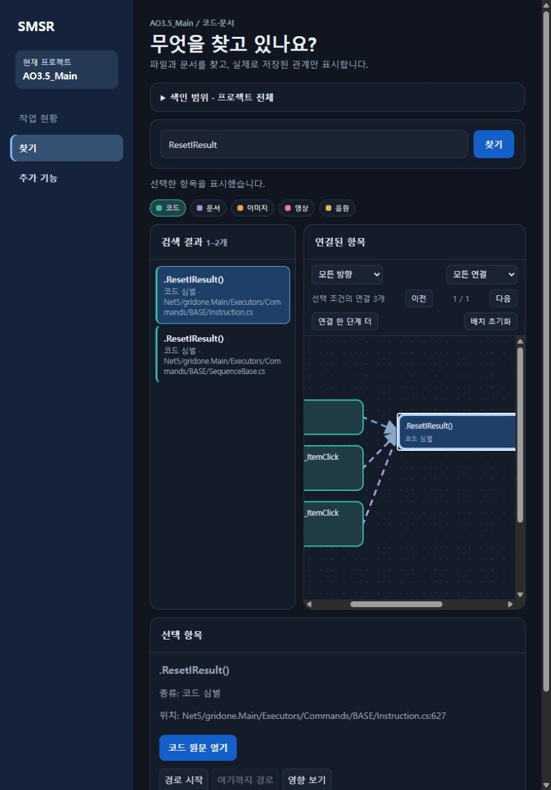

# 그래프 분석 보강·웹 조작 검증 — 2026-10-01

## 적용 범위

기존 분석 누락 보완, 저장 심층 결과 자동 통합, 변경 영향 재분석, 오래된 캐시 관리와 추가 요청 두 가지 UI를 구현했다. SQLite와 기존 Graphify 추출·로컬 분석기를 재사용했다. 새 전용 그래프 DB나 외부 서비스는 추가하지 않았다. Graphify 0.9.70 리비전 `4c21b15e9beeba5faa6871ad7dd188571a6fbb84`의 vendor 56개 모듈은 수정하지 않았다. 라이선스·NOTICE는 기존 동봉 파일을 유지한다.

## 동작과 경계

| 항목 | 적용 내용 | 안전한 제외·한계 |
| --- | --- | --- |
| 구문 복구 | C# 포인터·합법적인 contextual 이름과 Windows C/C++ 표식·헤더 문법을 분석 복사본에서 복구 | 원문·바이트 위치·줄·분기 선택은 바꾸지 않는다. 여러 줄 좌표 보존 불가·불완전 복구는 원문과 진단을 유지한다. |
| 호출 위치 | 기존에 유일하게 해소된 같은 파일·타입의 반복 호출 지점을 보충 | 동명·delegate 가림·다른 타입·중첩 실행 영역은 추가 확정하지 않는다. 원본 Graphify의 모든 오연결을 해결한 것은 아니다. |
| 심층 통합 | C#·Java·TypeScript·Python 보고서와 유일한 기본 심벌을 대응해 파생 관계·근거·manifest를 트랜잭션 저장 | 입력·설정·범위·분석 버전 검증. 컨텍스트 없는 과거 결과는 색인 리비전 변경 시 제외하며 같은 줄의 모호한 선언도 제외한다. 동적/가상 후보는 추론 관계를 유지한다. |
| 조회 | 관계·경로·영향·내보내기에서 통합 관계 및 분석 출처를 조회 | 기본 색인과 과거 스냅샷을 덮어쓰지 않는다. 통합은 유효한 저장 결과에 적용하며 매 색인마다 모든 심층 분석기를 실행하지 않는다. |
| 증분 | 암호화한 해소 컨텍스트·역방향 의존·미해소 후보로 추가/변경/삭제 영향만 재분석 | 일반 C#·Python을 전체 분석 정답과 대조했다. C/C++ 전역 병합, partial/global using 등 모호한 C#, 미검증 언어·설정/범위/버전 변화는 이유와 함께 전체 전환한다. |
| 캐시 | 마지막 사용 30일·총 페이로드 1 GiB 정책, 버전별 격리·손상 재추출 | 활성 프로세스 lease와 공유 잠금, junction/symlink/hardlink·외부 경로 차단. 활성 캐시 때문에 용량을 넘으면 정리를 유예한다. 원문·DB는 삭제하지 않는다. |
| 찾기 배치 | 노드 드래그, 연결선과 클릭 영역 동시 이동, 배치 초기화 | 화면 배치만 변경한다. 프로젝트·리비전·중심·필터 범위 전환 시 초기화한다. 영구 DB 배치 저장은 추가하지 않았다. |
| 근거 패널 | 실시간 활동 바로 아래 기본 접힘, 제목·건수·종류 카드 강조 | 기존 근거·링크·최근 표시 상한을 유지한다. 확인되지 않은 파일을 검증 완료로 승격하지 않는다. |

## 실제 AO3.5_Main 검증

- v11 분석 형식 변경으로 한 번 전체 재색인: 리비전9, 2,603파일, 20,406노드, 48,711관계. 코드 분석 `FULL`, 영향 1,237파일, 컨텍스트 저장 성공.
- 직후 무변경 재색인: 리비전9 유지, 변경·삭제 0, `UNCHANGED`, 영향 0·재사용 1,237파일. 단순 파일 목록뿐 아니라 기존 관계 분석을 재사용한다.
- 읽기 전용 DB·HTTP 대조: `integrity_check=ok`, foreign key 위반0. 기본/유효 관계 모두 고아·자기연결·중복 키0, `CALLS` 16,452개. 전체 진단56,828건에는 미해소·동적·외부 참조 등 `CALLS` 41,518건이 포함되어 오류 수나 누락률로 해석하지 않는다. AO3의 `deep-status=[]`·심층 관계/manifest0은 아직 별도 심층 분석을 실행하지 않은 상태이며 자동 통합 실패가 아니다. 실제 심층 통합은 4개 언어의 격리 검사에서 검증했다.
- 기존 `PARSE_ERROR` 15파일 재현 중 13파일을 복구했다. `Net5/Bot/BeatMania/Heart.cs`, `Net5/gridone.WindowSessionManager/CredentialLib/UnlockRegInfo.cs`는 실행 전처리 분기를 임의 선택하지 않기 위해 진단을 유지한다.
- 실제 찾기에서 `Instruction.ResetIResult()` 노드를 `(36, -65)`px 이동했다. 세 관계선과 클릭 영역이 함께 이동했고 중심 선택은 유지됐다. `배치 초기화` 후 모든 좌표가 원래 값으로 돌아가고 버튼이 비활성화됐다. 키보드 방향키 10px·Shift 30px은 자동 검사로 확인했다.
- 산출물 패널의 기본 접힘·활동 아래 위치와 실제 카드·링크를 확인했다. 실제 새로고침 검증에서 JS 자산404를 발견하여 서버 등록과 HTTP 회귀 검사를 추가했다. 수정 후 GET200·`text/javascript`·`no-store`·공개API본문, 새로고침과 실제 heartbeat의 SSE 갱신 후 펼침 유지·건수64→67 반영을 확인했다. 마지막에는 활동·근거 모두 기본 접힘으로 복원했다.



[근거 기본 접힘 화면](images/dashboard-evidence-2026-10-01.jpg) · [실제 근거 카드 화면](images/dashboard-evidence-expanded-2026-10-01.jpg)

## 자동 검사와 실행본

- Python 검사 파일 69개: 직접 실행 가능한 62개 종료 0, 보조 6개는 상위 검사에서 검증, LSP 표본 1개는 앱의 `--graph-lsp-self-test` 종료 0.
- 앱 통합 검사 5개 `--graph-self-test`, `--graph-static-self-test`, `--graph-advanced-self-test`, `--graph-deep-self-test`, `--tracking-self-test` 모두 종료 0. 실제 C#·Java·TypeScript·Python 통합, 입력/설정/범위/버전 무효화, HTTP 200/400/404와 과거 스냅샷·중복 방지를 포함한다.
- Node 검사 8개: labels, relations, expand, network, drag, placement, deep, disclosures 통과. 가짜 DOM 검사만으로 자산 제공 여부를 판정하지 않도록 실제 HTTP 검사를 보강했다.
- 반복 호출 보완 교차 검토에서 발견한 delegate·타입/이스케이프 가림, 여러 줄 포인터 좌표, alias와 문자열/주석 이름 충돌을 회귀 검사로 보완했다.
- Release 빌드 경고·오류 0. 실행 폴더와 SQLite snapshot·복원 백업을 남기고 실제 앱에 반영했다. 배포 중 공유 DLL 잠금과 기존 읽기 전용 `DailySummary`의 TwoWay 시작 예외를 확인했다. 같은 시작 실패 3회 이후 재시작을 중단하고 Windows 이벤트로 원인을 확인한 뒤 `Mode=OneWay`만 명시했다. 수정 후 앱·127.0.0.1 서버·새 자산을 확인했다.
- 접힘 경로 최종 검증 중 다른 대화의 티스토리 기능이 같은 폴더에서 작성 중이어서 전체 빌드가 미완성 타입으로 두 번 실패했다. 원본 파일은 수정하지 않고 `artifacts/graph-ui-source-20261001-101556` 복사본에서 해당 별도 기능의 파일·참조3곳·package만 빌드 범위에서 제외했다. 기존 실행본과 같은 기능 범위의 최종 UI 빌드는 경고·오류0, 추가 `--graph-self-test`와 `--tracking-self-test` 모두 종료0이다. 이 별도 기능을 이번 결과로 검증·완료했다고 주장하지 않는다.
- 최종 실행 DLL은 `artifacts/graph-ui-final-20261001/SMSR.App.dll`과 canonical 경로의 SHA256 `ABBDBDD42D46D2FCC2460501997B4668EF7A977979C50B59B1F22586CA33BB9A`가 일치한다. 앱 PID24836 유지와 실제 접힘 자산200을 확인했다. 첫 복사 시 종료 직후 파일 잠금이 남아 실패한 것은 성공으로 처리하지 않고 프로세스 종료를 확인한 다음 복사·시작했다. 이전 DLL도 별도 백업했다.
- 현재 대화의 이전 MCP transport는 배포를 위한 브리지 종료로 닫혔다. `scripts/invoke-smsr-tool.ps1`은 기존 브리지로 새 native MCP 연결을 열어 상태·결과를 기록한다. 인증값을 읽거나 출력하지 않는다. 다음 Codex 대화의 기존 제공자 연결 복구에는 Codex 재시작이 필요할 수 있다.

## 재현 명령

```powershell
dotnet build src/SMSR.App/SMSR.App.csproj -c Release --no-restore -o artifacts/graph-upgrade-20261001
node scripts/test_graph_explorer_drag.mjs
node scripts/test_graph_explorer_placement.mjs
node scripts/test_graph_explorer_deep.mjs
node scripts/test_dashboard_disclosures.mjs
```

앱 self-test는 격리 출력의 실행 파일에 위 플래그를 전달하고 실제 프로세스 종료 코드를 확인한다. 실제 색인은 기존 MCP `index_project_graph`로 수행하고 `get_graph_health`, 읽기 전용 SQLite와 브라우저 화면을 대조한다. 원본 소스 파일은 수정하지 않는다.

## 남은 사항

파일 색인 완료는 모든 언어의 모든 호출 판정 완료를 뜻하지 않는다. 위 2파일 전처리 분기, 원본 추출기의 동적·가상·오버로드·외부 패키지 한계와 구형 심층 결과 재분석은 남아 있다. 전체 16개 언어의 부분 재분석 정확도는 보장하지 않는다. 미디어 내용 분석·정밀 PDG/taint·컴파일러 수준 판정은 이번 범위 밖이다. AO3처럼 여러 언어와 전역 구조가 섞인 저장소는 코드 변경 시 안전한 전체 분석으로 전환할 수 있다.
